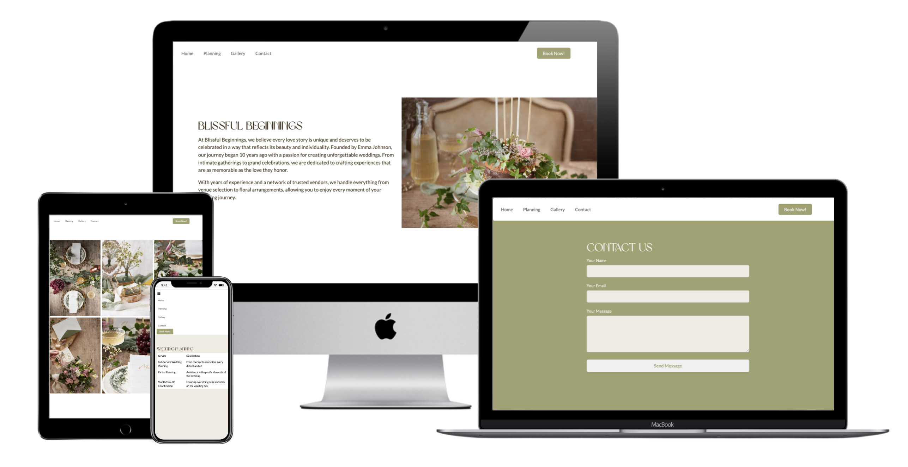

# Wedding Planning Services



This repository contains the source code for the Blissful Beginnings Wedding Website.

Check out the live website [here](https://aria-vero-s.github.io/wedding-web/).

## Description

Blissful Beginnings is a wedding planning business dedicated to crafting memorable experiences for every love story. Founded by Emma Johnson, our mission is to create unforgettable weddings that reflect the beauty and individuality of each couple. From intimate gatherings to grand celebrations, we handle every detail to ensure a seamless and joyful wedding journey.

## Features

- Introduction section with our story and mission statement
- Wedding planning services section
- Gallery featuring beautiful wedding images
- Contact form for inquiries

## Technologies Used

- Bootstrap: Frontend framework for responsive design
- Unsplash: Source of high-quality wedding images
- Google Fonts: Used the Lato font for text and Brown Sugar for headings

## Installation and Deployment

1. Clone the repository:

`git clone https://github.com/aria-vero-s/wedding-web.git`

2. Open the project in Visual Studio Code or any text editor.

3. Replace placeholder text or images with your own content.

4. Customize the website as needed.

5. Commit and push your changes to your GitHub repository.

6. Deploy the website using GitHub Pages or any other hosting service.

## Credits

- Images: Photos from the [Unsplash wedding series](https://unsplash.com/fr/photos/un-gateau-pose-sur-une-assiette-a-gateau-blanche-zmK9JRP02Z4) by [Unsplash](https://unsplash.com/)

## Color Palette

```css
:root {
 --black: #41341e;
 --green: #9FA36F;
 --yellow: #FFC677;
 --salmon: #FFA0AB;
 --white: #EEEBE3;
}
```

## Fonts
```
@import url('https://fonts.googleapis.com/css2?family=Lato:ital,wght@0,100;0,300;0,400;0,700;0,900;1,100;1,300;1,400;1,700;1,900&display=swap');

@font-face {
    font-family: 'Brown Sugar';
    src: url('/fonts/Brown-Sugar-.woff') format('woff');
    font-weight: normal;
    font-style: normal;
}
```

##License

This project is licensed under the MIT License
